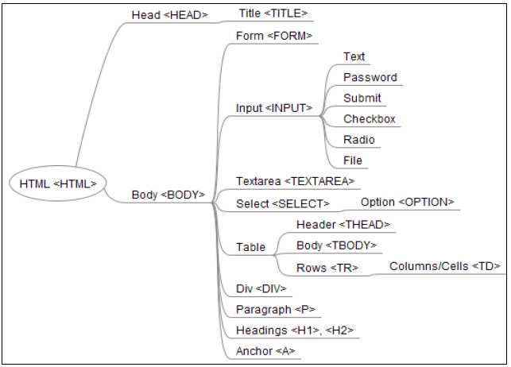
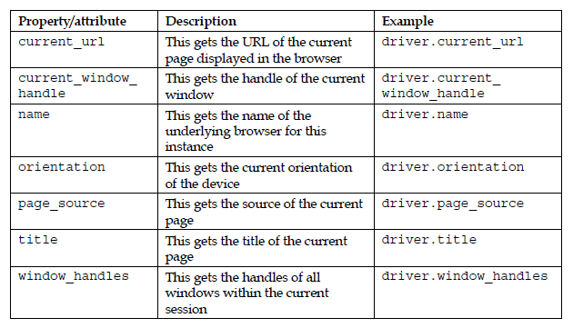
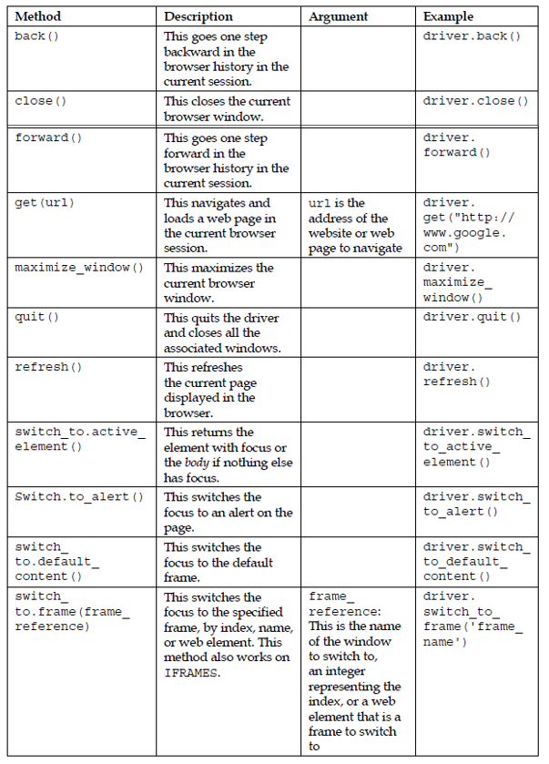
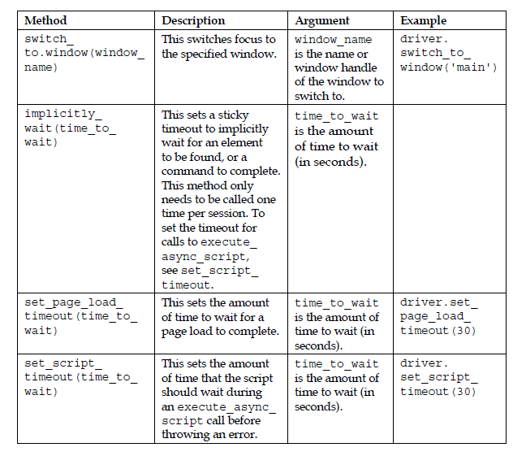
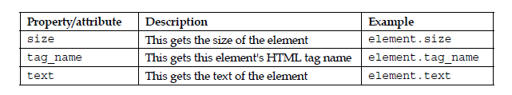
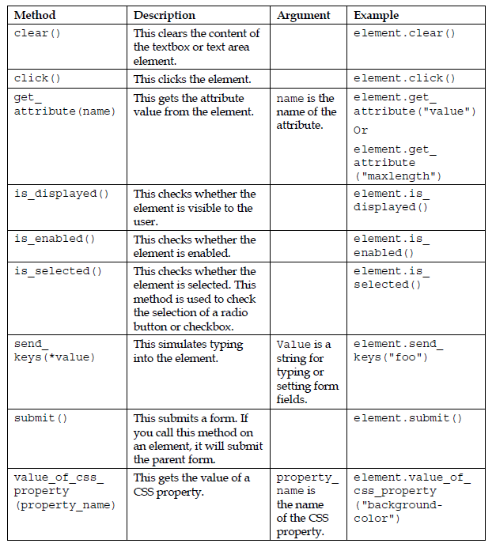

# Week 7
Advanced Web Driver and Web Element class attributes and properties

## Chapter 4. Using the Selenium Python API for Element Interaction 
Web applications use HTML forms to send data to a server. HTML forms contain input elements such as text fields, checkboxes, radio buttons, submit buttons, and more. A form can also contain select lists, text areas, field sets, legends, and label elements.
A typical web application requires you to fill in lots of forms, starting from registering as a user or searching for products. Forms are enclosed in the HTML <'form'> tag. This tag specifies the method of submitting the data, either using the GET or POST method, and the address at which the data entered into the form should be submitted on the server.

In this chapter, we will cover the following topics:
  * Understanding more about the WebDriver and WebElement classes
  * Implementing tests that interact with the application using various methods and properties of the WebDriver and WebElement classes
  * Using the Select class to automate dropdowns and lists
  * Automating JavaScript alerts and browser navigation

### Elements of HTML forms


Selenium WebDriver provides broad support for automating interaction with these elements as well as checking the functionality of the application.

### Understanding the WebDriver class
The WebDriver class provides a number of properties or attributes for browser interaction. We can use the properties and methods of the WebDriver class to interact with the browser window, alerts, frames and pop-up windows. It also provides features to automate browser navigation, access cookies, capture screenshots, and so on. In this chapter, we will explore some of the most important features of the WebDriver class. The following table covers some of the most important properties and methods that we will be using in the rest of the book.

#### Properties of the WebDriver class
The WebDriver class implements the following properties for accessing the browser:




#### Methods of the WebDriver class
The WebDriver class implements various methods to interact with the browser
window, web pages, and the elements on these pages. Here is a list of some
important methods:






### Understanding the WebElement class
We can interact with elements on a web page using the WebElement class. We can interact with a textbox, text area, button, radio buttons, checkbox, table, table row, table cell, div, and so on using the WebElement class. The WebElemet class provides a number of properties or attributes and methods to interact with the elements. The next table covers some of the most important properties and methods that we will be using in the rest of the book. For a complete list of properties and methods, visit [seleneium webdriver and webelement.](http://selenium.googlecode.com/git/docs/api/py/webdriver_remote/selenium.webdriver.remote.webelement.html#module-selenium.webdriver.remote.webelement.)

#### Properties of the WebElement class
The WebElement class implements the following properties:




#### Methods of the WebElement class
The WebElement class implements the following methods:




#### Examples:
##### Select class for Drop Down Lists

```python
  from selenium.webdriver.support.ui import Select
  
  # get the Your language dropdown as instance of Select class
  select_language = Select(self.driver.find_element_by_id("select-language"))
  
  # check number of options in dropdown
  self.assertEqual(2, len(select_language.options))
  
  # get options in a list for option in select_language.options:
  act_options.append(option.text)
```

##### Alert class for webdriver alerts 

```python
  # click on Remove this item link, this will display
  # an alert to the user
  self.driver.find_element_by_link_text("Clear All").click()

  # switch to the alert
  alert = self.driver.switch_to_alert()
  
  # get the text from alert
  alert_text = alert.text
  
  # check alert text
  self.assertEqual("Are you sure you would like to remove all products from your comparison?", alert_text)
  
  # click on Ok button
  alert.accept()
```

### Chapter 5. Synchronizing Tests
Building robust and reliable tests is one of the critical success factors of automated UI testing. However, you will come across situations where testing conditions differ from one test to another. When your script searches for elements or a certain state of application and it cannot find these elements anymore because the application starts responding slowly due to sudden resource constraints or network latency, the tests report false negative results. We need to match the speed of the test script with the application's speed by introducing delays in the test script. In other words, we need to sync the script with the application's response. WebDriver offers implicit and explicit waits to synchronize tests. 

In this chapter, you will learn about the following topics:
  * Using implicit and explicit wait
  * When to use implicit and explicit wait
  * Using expected conditions
  * Creating a custom wait condition

#### Examples:
```python
  from selenium.webdriver.common.by import By
  from selenium.webdriver.support.ui import WebDriverWait as WDW
  from selenium.webdriver.support import expected_conditions as EC

  first_name = self.driver.find_element_by_id("firstname")
  WebDriverWait(self.driver, 10).until(expected_conditions.visibility_of(first_name))
```
```python
  WebDriverWait(self.driver, 10).until(expected_conditions.visibility_of_element_located((By.ID,"firstname")))
````

### Chapter 9. Advanced Techniques of Selenium WebDriver

So far in the book, we have seen how to set up Selenium WebDriver for testing web applications and some of the important features and APIs for locating and interacting with various elements in the browser. In this chapter, we will explore some of the advanced APIs of Selenium WebDriver. These features come in handy when you're testing fairly complex applications. 

In this chapter, you will learn more about: 
  * Creating tests that simulate keyboard or mouse events using the Actions class
  * Simulating mouse operations such as drag-and-drop and double-click
  * Running JavaScript code
  * Capturing screenshots and movies of test runs
  * Handling browser navigation and cookies

#### Examples:
##### Keyboard actions

```python
  from selenium import webdriver
  from selenium.webdriver.common.by import By
  from selenium.webdriver.support.ui import WebDriverWait
  from selenium.webdriver.support import expected_conditions
  from selenium.webdriver.common.action_chains import ActionChains
  from selenium.webdriver.common.keys import Keys

  # to perform Shift + N key press as if a real user has pressed these keys:
  ActionChains(driver).key_down(Keys.SHIFT).send_keys('n').key_up(Keys.SHIFT).perform()
```
##### Mouse Actions
```python
  # mouse hover over a button and click on the appeared Top link
  mouse_hover_button = self.driver.find_element_by_id('mousehover')
  actions = ActionChains(self.driver)
  actions.move_to_element(mouse_hover_button).perform()
  top_item = self.driver.find_element_by_css_selector(".mouse-hover a[href='#top']")
  actions.move_to_element(top_item).click().perform()

  # mouse double click on box container
  box = driver.find_element_by_tag_name("div")
  ActionChains(driver).move_to_element(driver.find_element_by_tag_name("span")).perform()
  ActionChains(driver).double_click(box).perform()
  
  # mouse drag and drop 
  source = driver.find_element_by_id("draggable")
  target = driver.find_element_by_id("droppable")
  ActionChains(self.driver).drag_and_drop(source, target).perform()
  ```
  ##### Execute Java Script by calling execute_script method of the WebDriver class
  ```python
  # scroll down
  driver.execute_script("Window.ScrollBy(0, 1000);")
  
  # scroll up
  driver.execute_script("Window.ScrollBy(0, -1000);")
  
```

## References
* [Selenium Documentation - Locating Elements](https://selenium-python.readthedocs.io/locating-elements.html#locating-by-id)
* [Learning Selenium Testing Tools with Python](https://www.amazon.com/gp/product/B00RP13D10/ref=dbs_a_def_rwt_hsch_vapi_tkin_p1_i1)
